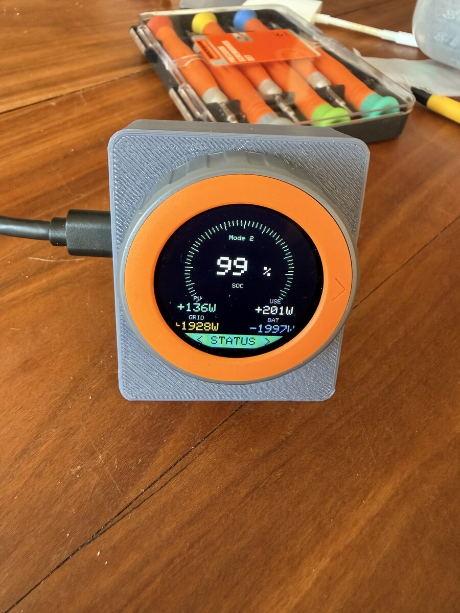
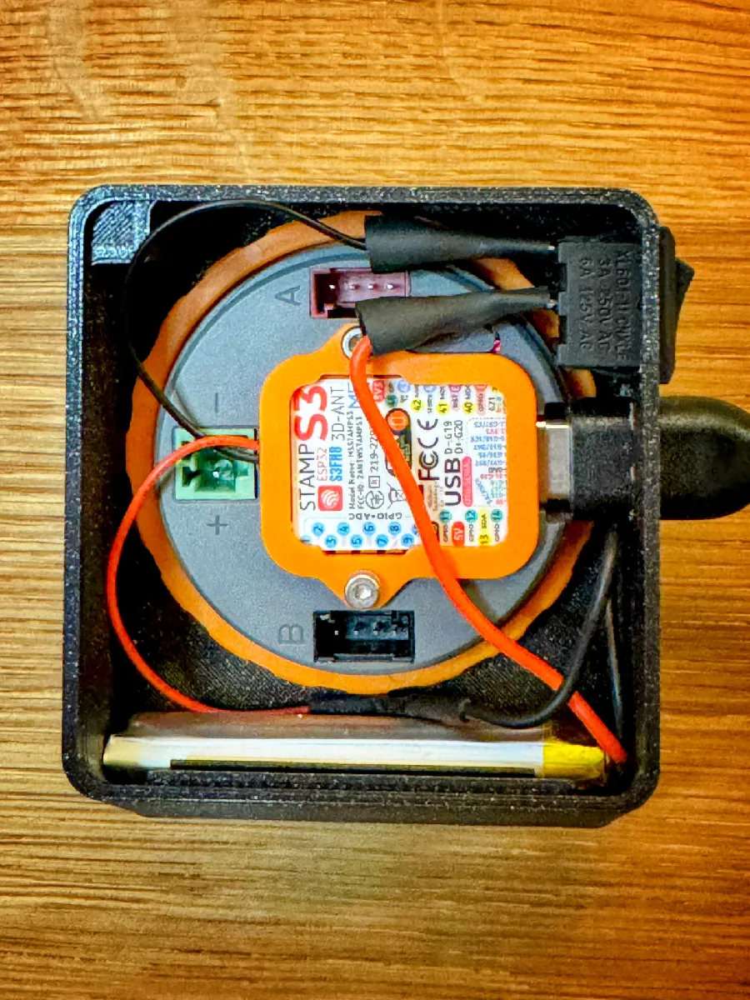

# Sonnenbatterie ESP32 Controller

Stand-alone afstandsbediening voor een sonnenBatterie op een M5Stack Dial.

<p>
  
  
</p>

## Wat Dit Is

Deze repository bevat firmware, hulpmiddelen en hardwarebestanden voor een compacte M5Stack Dial remote:

- statusweergave voor SOC, PV, huisverbruik, net en batterijvermogen
- menu met `STATUS`, `AUTO`, `CHARGE`, `DISCH` en `DIM`
- laad- en ontlaadsetpoints tot 3,6 kW
- bewuste bevestiging voordat er een schrijfcommando naar de batterij gaat
- adaptieve refresh: sneller bij actief laden/ontladen, rustiger bij weinig batterijvermogen
- automatische terugval naar veilige configuratiebestanden zonder secrets
- testscript voor end-to-end controle van laden, ontladen en terug naar auto

## Veiligheid

Publiceer nooit je echte `sonnen_config.h`. Die kan Wi-Fi-gegevens en de lokale Sonnen API-token bevatten.

Deze repo bevat alleen:

- `config.example.h`
- scripts om lokaal een eigen `sonnen_config.h` te maken
- `.gitignore` die `arduino/sketchbook/SonnenDialRemote/sonnen_config.h` uitsluit

Controleer voor een eerste echte test altijd:

```sh
scripts/sonnen-probe status --host 192.168.1.50 --token YOUR_TOKEN
```

Schrijfacties staan in een nieuwe configuratie standaard uit. Zet `SONNEN_ALLOW_WRITES` pas aan als status uitlezen betrouwbaar werkt.

## Firmware

Sketch:

```text
arduino/sketchbook/SonnenDialRemote/SonnenDialRemote.ino
```

Belangrijk gedrag:

- `STATUS`: leest de actuele Sonnen-status opnieuw uit
- `AUTO`: zet de batterij terug naar self-consumption / automatische regeling
- `CHARGE`: handmatig laden met gekozen wattage
- `DISCH`: handmatig ontladen met gekozen wattage
- `BAT +1000W`: batterij laadt
- `BAT -1000W`: batterij ontlaadt

## Configuratie

Maak lokaal een private config:

```sh
scripts/sonnen-probe make-config \
  --wifi-ssid YOUR_WIFI \
  --wifi-password YOUR_PASSWORD \
  --host 192.168.1.50 \
  --token YOUR_TOKEN
```

Daarna kun je in `arduino/sketchbook/SonnenDialRemote/sonnen_config.h` bewust writes aanzetten:

```c
#define SONNEN_ALLOW_WRITES 1
```

## Build En Upload

Installeer de M5Dial library:

```sh
scripts/sonnen-dial libs
```

Compileer:

```sh
scripts/sonnen-dial compile
```

Zoek de USB-poort:

```sh
scripts/sonnen-dial ports
```

Upload:

```sh
scripts/sonnen-dial upload /dev/cu.usbmodemXXXX
```

## Systeemtest

Het echte schrijfpad kan met een expliciete test worden gecontroleerd. Dit script voert zonder `--confirm-write YES` geen schrijfcommando's uit.

Plan bekijken:

```sh
scripts/sonnen-system-test plan
```

Volledige 1000W test:

```sh
scripts/sonnen-system-test run --confirm-write YES
```

De test:

- leest baseline-status
- stuurt `DISCHARGE 1000W`
- controleert of de batterij rond 1000W ontlaadt
- zet terug naar `AUTO`
- stuurt `CHARGE 1000W`
- controleert of de batterij rond 1000W laadt
- zet tot slot altijd opnieuw `AUTO`

## Behuizing

De behuizing staat in `hardware/case/`.

Bron van het ontwerp:

[M5Stack Dial Case op Printables](https://www.printables.com/model/992288-m5stack-dial-case/files)

Controleer de actuele licentievoorwaarden op Printables voordat je de STL-bestanden verder verspreidt of commercieel gebruikt.

## Documentatie

- [Firmware README](arduino/sketchbook/SonnenDialRemote/README.md)
- [Hardware checklist](docs/sonnen-dial-hardware.md)
- [Casebestanden](hardware/case/README.md)
